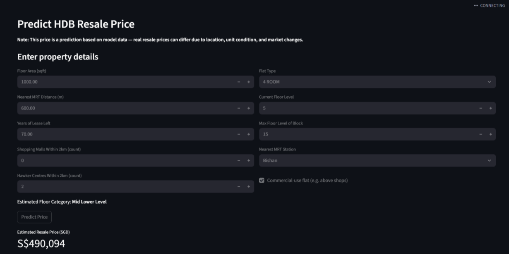

# hdb_price_predictor
As a data analyst at a leading real estate agency in Singapore. The HDB resale market has become increasingly competitive, with a rise in demand and volatile pricing trends. The agency wants to empower their agents with a data-driven tool to:
● Off er competitive pricing advice for clients looking to buy or sell HDB resale fl ats.
● Accurately estimate HDB resale fl at values for diff erent fl at types and locations. Your manager informs you that a team of data analysts is being formed to analyse the HDB resale market in Singapore and build a predictive model in a short turnaround.

## dataset
repo contains test.csv and train.csv use for ML model testing

## feature selection EDA
feature selected based on correlation with target vraiable (HDB prices)

## linear regression and XGBoost model testing
- linear regression
    RSME : $72,109
    R2: 0.75

- XGboost
    RSME: $39,330
    R2: 0.93

## conclusion
XGboost provided a better model with lower RSME

## streamlit app preview

